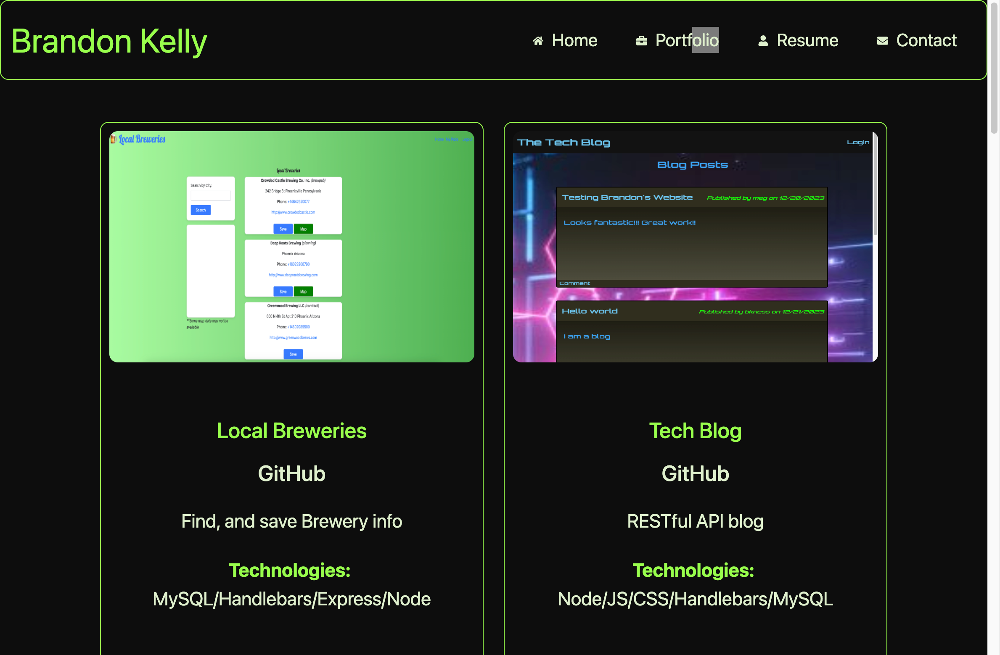
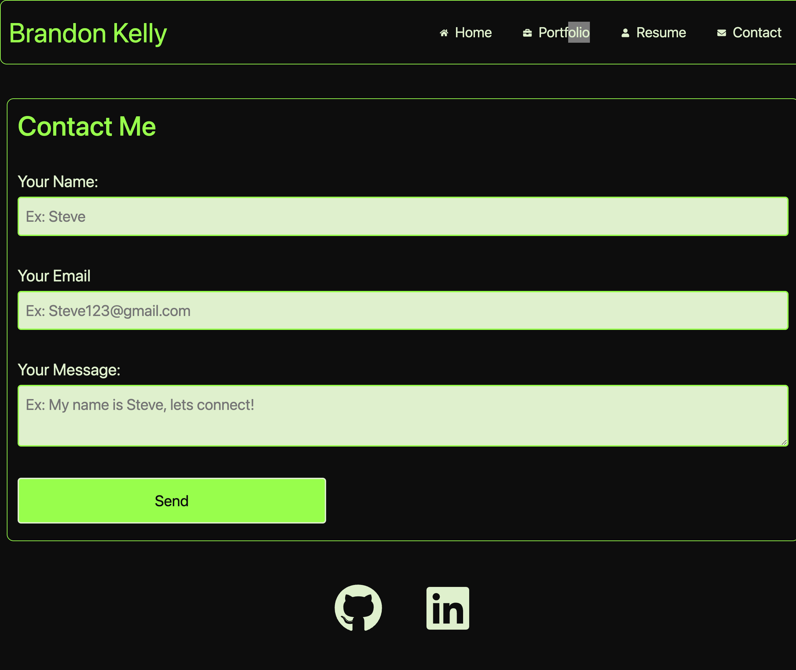

# React Portfolio

## Description 
This is a portfolio I created with react. Using headers and footers combined with a navbar I was able to make a portfolio that is easy for the user to navigate through

## Table of Contents 📝

- [Installation](#installation)
- [Usage](#usage)
- [Test](#test)
- [Contributing](#contributing)

- [Questions](#questions-📝)

## Installation 
npm i

## Usage
To install this repo the user would have to install the packages with npm install and then run node on the index.js file.

## Test 
npm test

## Contributing
Fork the project and open a pull request with your new code

## Deployed 
The github repo can be viewed [here](https://github.com/bkness/React-Portfolio)

The deployed profile can be viewed [here](https://jazzy-scone-ff682e.netlify.app/)

## Questions
If you have any questions you can email me at kbrandon863@gmail.com if you want to see more of my work, visit my GitHub at [bkness](https://github.com/bkness)
